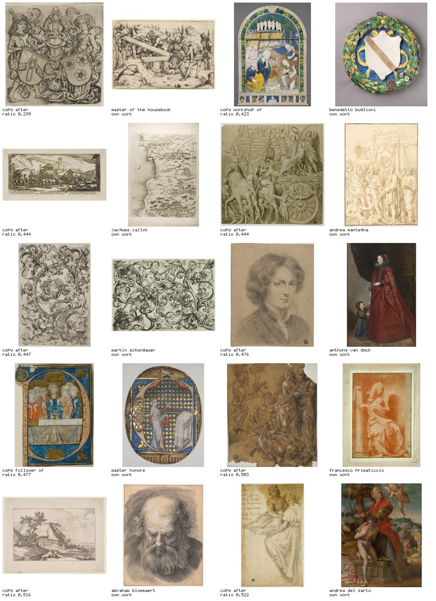

# The pair test — does a copy land nearer its source?

Generated by `npm run influence -- pairs`. Descriptors `v1`.
50 random works drawn per pair, repeated over 5 seeds (1, 2, 3, 7, 99).

## The headline

**3 of the 4 descriptor layers did not separate a copy from a stranger.**
Only `texture` cleared the sign test — texture at 58/82 pairs nearer their source (z=3.75). Everything else on this page is a null: `armature`, `palette`, `form`.

This is the gate for the rest of the influence layer, and most of it did not pass. A direction, a
dial or a sweep built on a layer marked NOTHING MEASURED below is moving a number that has **not**
been shown to carry influence through this corpus. That does not make it useless — it makes every
claim about it a claim about the descriptor, not about influence.

Note the direction on `form`: the median copy sits *further* from its named source artist than from fifty random works. The sign test does not clear the threshold, so this is reported as a null rather than as a reversal — but it is not evidence of a weak positive effect either, and should not be quoted as one.

## What was measured

19791 distinct corpus images carry a descriptor row. 2148 named persons have at
least one work in the corpus that is not itself a copy. 261 works have a creator
field that claims a derivation; 238 of those name a person rather than a
placeholder; **82** name a person this corpus also holds work by, and those are
the pairs below.

The corpus almost never holds the specific painting a print was made after, so the pair distance is
the **median distance from the copy to the named artist's own works**, and the baseline is the
median distance from the same copy to 50 random corpus works. Same estimator on
both sides. A ratio below 1 means the copy sits nearer its source than nearer a stranger.

## The table

| layer | median to source | median to 50 random | ratio (range over seeds) | pairs nearer source | sign-test z | verdict |
|---|---|---|---|---|---|---|
| `armature` | 17.323 | 17.747 | 0.976 (0.968–0.994) | 47/82 | 1.33 | **NOTHING MEASURED** |
| `palette` | 6.135 | 6.475 | 0.947 (0.937–0.955) | 49/82 | 1.77 | **NOTHING MEASURED** |
| `texture` | 7.818 | 8.513 | 0.918 (0.900–0.929) | 58/82 | 3.75 | nearer its source |
| `form` | 5.728 | 5.530 | 1.036 (1.008–1.047) | 43/82 | 0.44 | **NOTHING MEASURED** |

### Why the verdict is the sign test and not the ratio

The ratio was the obvious statistic and it is not a stable one. Re-running this test over the five
seeds moved `palette` between 0.937 and 0.955 — across a ±0.05 band around 1.0 — so a band verdict
for that layer would have been a fact about which fifty works were drawn. The count of pairs sitting
nearer their source moved by at most two over the same seeds, because it asks about each pair
separately rather than about a median of medians. So `wins` decides and the ratio is reported with
its spread. z=2.0 is roughly the 5% two-sided point; it is a threshold, not a
p-value, and there is no multiple-comparison correction across the 4 layers.

### 3 of 4 layers measured nothing

- **`armature` — 47/82 pairs nearer, z=1.33, ratio 0.976 (0.968–0.994).** A copy is not measurably nearer its source than a random object in this corpus is, on this descriptor.
- **`palette` — 49/82 pairs nearer, z=1.77, ratio 0.947 (0.937–0.955).** A copy is not measurably nearer its source than a random object in this corpus is, on this descriptor.
- **`form` — 43/82 pairs nearer, z=0.44, ratio 1.036 (1.008–1.047).** A copy is not measurably nearer its source than a random object in this corpus is, on this descriptor.

## Splits

Only splits with at least 20 pairs get a table. The rest are listed underneath as counts
and nothing else: at n=6 the sign test calls 6/6 significant, and a "nearer its source" verdict off
six works reads exactly like one off sixty-six.

### relation: after (n=66)

| layer | median to source | median to 50 random | ratio (range over seeds) | pairs nearer source | sign-test z | verdict |
|---|---|---|---|---|---|---|
| `armature` | 17.746 | 17.502 | 1.014 (0.998–1.024) | 37/66 | 0.98 | **NOTHING MEASURED** |
| `palette` | 6.315 | 6.405 | 0.986 (0.971–1.000) | 37/66 | 0.98 | **NOTHING MEASURED** |
| `texture` | 8.033 | 8.545 | 0.940 (0.925–0.966) | 47/66 | 3.45 | nearer its source |
| `form` | 5.728 | 5.519 | 1.038 (1.024–1.074) | 33/66 | 0.00 | **NOTHING MEASURED** |

### derivative is a print (n=33)

| layer | median to source | median to 50 random | ratio (range over seeds) | pairs nearer source | sign-test z | verdict |
|---|---|---|---|---|---|---|
| `armature` | 15.527 | 16.887 | 0.920 (0.880–0.932) | 19/33 | 0.87 | **NOTHING MEASURED** |
| `palette` | 5.754 | 6.165 | 0.933 (0.909–0.957) | 17/33 | 0.17 | **NOTHING MEASURED** |
| `texture` | 8.255 | 10.571 | 0.781 (0.767–0.801) | 27/33 | 3.66 | nearer its source |
| `form` | 6.257 | 5.352 | 1.169 (1.142–1.190) | 12/33 | -1.57 | **NOTHING MEASURED** |

### derivative is not a print (n=49)

| layer | median to source | median to 50 random | ratio (range over seeds) | pairs nearer source | sign-test z | verdict |
|---|---|---|---|---|---|---|
| `armature` | 18.428 | 18.362 | 1.004 (0.961–1.042) | 29/49 | 1.29 | **NOTHING MEASURED** |
| `palette` | 6.241 | 6.815 | 0.916 (0.891–0.928) | 32/49 | 2.14 | nearer its source |
| `texture` | 6.885 | 8.086 | 0.851 (0.833–0.867) | 31/49 | 1.86 | **NOTHING MEASURED** |
| `form` | 5.498 | 5.757 | 0.955 (0.930–0.989) | 30/49 | 1.57 | **NOTHING MEASURED** |

### Too small to measure

- relation: workshop of — 6 pairs
- relation: follower of — 3 pairs
- relation: circle of — 2 pairs
- relation: imitator of — 2 pairs
- relation: style of — 2 pairs
- relation: school of — 1 pair

## The ten tightest pairs

Ranked on `texture` — the layer that cleared the sign test, and nothing else.
Averaging all four layers would have ranked these pairs mostly on the 3 that measure nothing, and produced a contact sheet of noise that looked exactly like evidence.

Cells alternate: the copy, then one of the source artist's own works.

| ratio (texture) | relation | copy (sha256, title) | source artist (own works) |
|---|---|---|---|
| 0.299 | after | `95a826b3383d` Coat of Arms of Rohrbach and Eilge von Holzhausen | master of the housebook (1) |
| 0.423 | workshop of | `f1e86e54cd88` Adoration of the Shepherds | benedetto buglioni (1) |
| 0.444 | after | `83125b2a6bad` Plundering and Burning a Village, plate seven from The Large | jacques callot (1) |
| 0.444 | after | `98297ae85c95` Triumphs of Julius Caesar: Canvas No. IX | andrea mantegna (2) |
| 0.447 | after | `872e1630494e` Ornament with Owl Mocked by Day Birds | martin schongauer (2) |
| 0.476 | after | `38378f0ff6da` Anthony van Dyck | anthony van dyck (2) |
| 0.477 | follower of | `2fe7d106542b` Bishop at Mass in a Historiated Initial "P" from a Choirbook | master honore (1) |
| 0.503 | after | `fcc61c3de17a` Return of Agamemnon | francesco primaticcio (1) |
| 0.516 | after | `27602e749db2` Plate 3, from Landscapes with Farmhouses | abraham bloemaert (1) |
| 0.522 | after | `927f0b6b45b5` Saint Anne and Standing Woman with Salver | andrea del sarto (1) |

## The ten loosest pairs

| ratio (texture) | relation | copy (sha256, title) | source artist (own works) |
|---|---|---|---|
| 1.849 | imitator of | `c84eb5adf92b` Death on a White Horse | william blake (2) |
| 1.573 | after | `d9bb52171bac` Various Subjects of Landscape Characteristic of English Land | john constable (4) |
| 1.573 | after | `d0f1237ee07c` Madonna with the Monkey | albrecht durer (11) |
| 1.553 | after | `2b2d5305b98a` Various Subjects of Landscape Characteristic of English Land | john constable (4) |
| 1.535 | after | `f5e8b7c709c6` Archers Shooting at a Herm, Triumph of Bacchus, and Other St | michelangelo buonarroti (1) |
| 1.484 | after | `c1fab6daf940` Various Subjects of Landscape Characteristic of English Land | john constable (4) |
| 1.447 | after | `02c67b11c0ef` Frederick William, Elector of Brandenburg, from Nine Portrai | gerrit van honthorst (1) |
| 1.440 | after | `92f264b842d9` Various Subjects of Landscape Characteristic of English Land | john constable (4) |
| 1.410 | follower of | `31184f6bdc58` Anatomical Study and Sketch of Kneeling Figure | michelangelo buonarroti (1) |
| 1.358 | after | `da64e4747443` The Handwriting on the Wall | john doyle (1) |

## How to read this honestly

- The ratio is a **median over pairs of a median over works**. It is robust to one bad join and it is
  not a significance test. With n=82, a layer 3% from 1.0 has shown nothing.
- "Source artist" is a **name**, joined on spelling. This corpus has no artist authority file, so two
  people with the same name are one person here and one person with two spellings is two.
- The count in brackets after each artist is how many of their own works the median was taken over.
  A pair whose artist has one work in the corpus is a distance between two images wearing the same
  clothes as a distance between an image and an oeuvre.
- `after` dominates the sample. The other relations are reported where n>=5 and are too small to
  carry an argument on their own.
